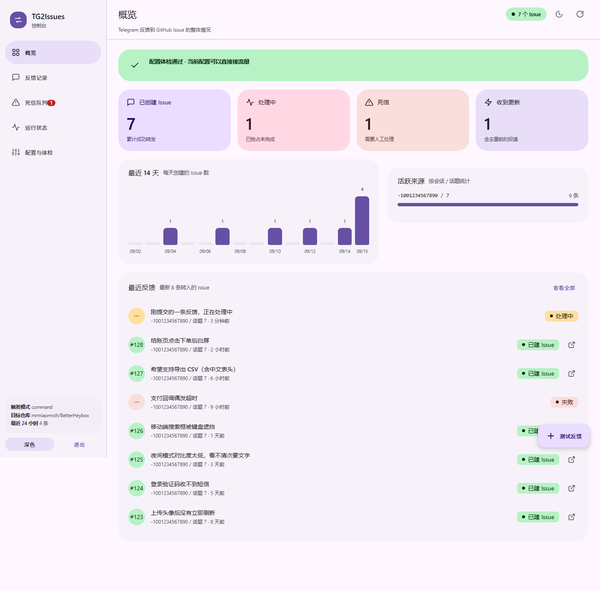
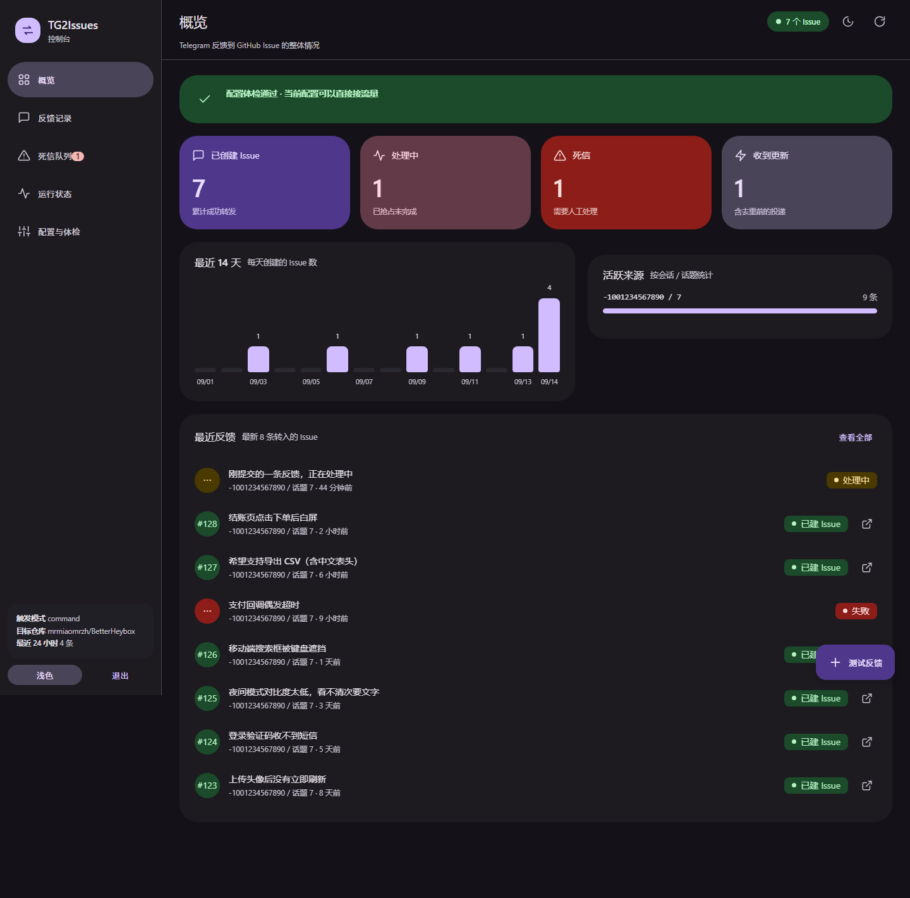
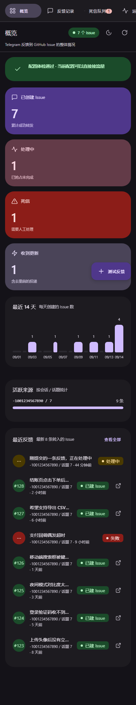

# TG2Issues

[](https://github.com/Mrmiaomrzh/TG2Issues/actions/workflows/ci.yml)
[](LICENSE)
[](https://workers.cloudflare.com/)
[](https://www.typescriptlang.org/)

Automatically turn **tips, feedback, suggestions and bug reports** from Telegram groups into **GitHub issues** — then mirror issue comments and closures **back** to the original Telegram chat. Ships with a zero-dependency **web dashboard** for browsing records, retrying dead letters and running self-checks.

- Runtime: **Cloudflare Workers** (no server, free tier is enough)
- Stack: TypeScript + **Hono** (routing) + **grammY** (Telegram API) + **Cloudflare D1** (SQLite state)
- Triggers: every message in a chosen **forum topic**, slash commands, or all messages in allow-listed chats
- Content: text + images (images are re-hosted to an assets repo and referenced from the issue)
- Dashboard: open `/` and sign in with `ADMIN_TOKEN` — no build step
- Design notes: `REQUIREMENTS.md`

```
Telegram (group / topic)
   │  POST /tg/webhook/<secret>        (validates X-Telegram-Bot-Api-Secret-Token)
   ▼
Cloudflare Worker ── Hono router ── returns 200 immediately, then waitUntil
   │  1. dedupe by update_id     2. chat/topic allow-list   3. rate limit
   │  4. extract text + media    5. redact secrets          6. render issue draft
   │  7. re-host images (Contents API)  8. create issue     9. reply in the topic
   ▼
GitHub Issues ── POST /github/webhook (HMAC-SHA256 verified)
   └─ issue comment / closed / reopened ──▶ back to the original Telegram chat

Browser ── GET / (static page, no secrets) ──▶ GET /api/* (Bearer ADMIN_TOKEN)
```



<details>
<summary>Dark theme / mobile</summary>





</details>

---

## 1. Quick start

### 1.0 Requirements
- Node.js 20+ (verified on Node 24)
- A Cloudflare account (free plan works) with `npx wrangler login` completed
- A Telegram bot token from [@BotFather](https://t.me/BotFather)
- A GitHub fine-grained PAT

### 1.1 Install
```bash
npm install
```

### 1.2 Create the D1 database
```bash
npm run db:create
```
Put the `database_id` from the output into the `[[d1_databases]]` section of `wrangler.toml`.

> **Where private config goes**: real chat ids, target repos and the D1 id belong in `wrangler.local.toml` (already git-ignored).
> `scripts/cf.mjs` prefers that file automatically, so `npm run deploy` / `npm run db:*` never write private values back into the committed template:
>
> ```bash
> cp wrangler.toml wrangler.local.toml   # then edit only wrangler.local.toml
> ```

### 1.3 Local secrets
```bash
cp .dev.vars.example .dev.vars      # Windows: copy .dev.vars.example .dev.vars
```
Fill in `.dev.vars` (git-ignored):

| Variable | Purpose |
| --- | --- |
| TG_BOT_TOKEN | Token from BotFather |
| TG_WEBHOOK_SECRET | Random string (`openssl rand -hex 32`); used in both the URL path and the request header |
| GH_TOKEN | Fine-grained PAT with **Issues: Read and write** + **Contents: Read and write** |
| GH_WEBHOOK_SECRET | Secret for the GitHub reverse webhook (random string) |
| ADMIN_TOKEN | Token for the dashboard and `/api/*` (any random string) |

### 1.3.1 Optional demo data (to preview the dashboard)

```bash
npm run db:demo     # 9 sample records + 1 dead letter
npm run db:clear    # wipe everything
```

### 1.4 Migrations
```bash
npm run db:migrate:local     # local miniflare D1
npm run db:migrate:remote    # after deploying to Cloudflare
```

### 1.5 Run locally
```bash
npm run dev
```
The Worker listens on http://127.0.0.1:8787 and that URL **is** the dashboard. Telegram requires HTTPS for webhooks, so expose the port with any tunnel (for example `cloudflared tunnel --url http://127.0.0.1:8787`), then either click **Set Telegram Webhook** on the *Runtime* page or call the API directly:

```bash
curl -X POST -H "Authorization: Bearer <ADMIN_TOKEN>" "https://<your-tunnel-host>/api/actions/set-webhook"
```

### 1.6 Deploy
```bash
npm run deploy                      # same as: node scripts/cf.mjs deploy (picks the right config)
node scripts/cf.mjs secret put TG_BOT_TOKEN
node scripts/cf.mjs secret put TG_WEBHOOK_SECRET
node scripts/cf.mjs secret put GH_TOKEN
node scripts/cf.mjs secret put GH_WEBHOOK_SECRET
node scripts/cf.mjs secret put ADMIN_TOKEN
npm run db:migrate:remote
```
**Or do it in one command** (reads `.dev.vars` → pushes 5 secrets → applies migrations → deploys → registers the webhook → self-checks):

```bash
pwsh -File scripts/deploy.ps1              # full run
pwsh -File scripts/deploy.ps1 -SkipSecrets # secrets unchanged, deploy only
```

Manual alternative — register the webhook and self-check afterwards:
```bash
curl -X POST -H "Authorization: Bearer <ADMIN_TOKEN>" "https://tg2issues.<your-subdomain>.workers.dev/api/actions/set-webhook"
curl -H "Authorization: Bearer <ADMIN_TOKEN>" "https://tg2issues.<your-subdomain>.workers.dev/api/selfcheck"
```

---

## 2. Telegram setup

1. **Disable privacy mode**: talk to [@BotFather](https://t.me/BotFather) → `/setprivacy` → pick your bot → **Disable**.
   Otherwise the bot only sees commands, mentions and replies in groups — plain messages inside a topic are never delivered, so topic triggering will not work.
2. Add the bot to the target group and let it **send messages** (making it an admin is the easiest way in restricted groups).
3. Get the chat id and topic id: post any message in the topic, then call
   `curl "https://api.telegram.org/bot<TOKEN>/getUpdates"` (first delete the webhook — click **Delete Webhook** in the dashboard or `POST /api/actions/delete-webhook`),
   and read `message.chat.id` and `message.message_thread_id` from the response.
4. Put those values into `TG_ALLOWED_CHAT_IDS` and `TG_TOPIC_IDS` (comma-separated, multiple allowed).
   **Empty means deny everything** — that is intentional (fail-closed), and the dashboard's *Config* page will tell you.

### 2.1 Commands

Besides topic forwarding, the bot understands a set of commands (usable in groups or in a private chat):

| Command | What it does |
| --- | --- |
| `/issue <text>` | Submit feedback and create an issue. Images only, or image + caption, also work. Aliases: `/bug`, `/suggest` |
| `/issues [n]` | List recent feedback **from this chat** (5 by default, 20 max), with issue links |
| `/issues all [n]` | List feedback across chats; requires the sender id to be in `TG_ALLOWED_USER_IDS` |
| `/link` | **Reply** to a feedback message and send this to look up its issue |
| `/stats` | Totals: all time / last 24h / pending / dead letters |
| `/status` | Runtime status: trigger mode, target repo, rate limits, pending webhook updates |
| `/help`, `/start` | Show help |

Notes:
- Commands only work in allow-listed chats and are still subject to dedupe, rate limiting and redaction.
- Commands bypass the topic restriction: you can submit with `/issue` from anywhere in the chat.
- Command messages are delivered **even with privacy mode enabled**; only plain topic messages need privacy mode disabled.
- Argument parsing ignores the `@botname` suffix and the command prefix is stripped from the issue body.
- `/issues` lists **only the current chat** by default, so a public group never leaks other groups' feedback titles. Cross-chat listing needs `/issues all` plus your user id in the allow-list.

### 2.2 Using commands in a regular group chat (recommended)

If you do not use forum topics and just want `/bug` and `/issues` in a normal group:

```toml
# wrangler.toml (or wrangler.local.toml)
[vars]
TG_TRIGGER_MODE = "command"              # commands only; ordinary chat never creates issues
TG_ALLOWED_CHAT_IDS = "-1001234567890"   # chats allowed to use commands (comma-separated)
TG_TOPIC_IDS = ""                        # leave empty when not using topics
TG_ALLOWED_USER_IDS = "123456789"        # optional: who may use /issues all
```

Steps:
1. Create a bot with @BotFather (or reuse one). You do **not** need to disable privacy mode — command messages are always delivered.
2. Add the bot to the group; it only needs permission to send messages (admin is not required).
3. Get the chat id: post a message in the group → temporarily delete the webhook → `curl "https://api.telegram.org/bot<TOKEN>/getUpdates"` → read `message.chat.id` (looks like `-1001234567890`).
4. Put it into `TG_ALLOWED_CHAT_IDS` and redeploy.
5. Send `/help` to verify; `/bug checkout button does nothing` creates an issue and replies with the link.

Behaviour:
- `/bug <text>` in a group creates an issue and replies with the link; a screenshot alone works too.
- `/issues` is chat-scoped.
- Rate limits are per user: 3/minute and 20/day by default (`RATE_PER_MIN` / `RATE_PER_DAY`).
- In `command` mode every non-command message is ignored, so chit-chat never pollutes the repo.

---

## 3. GitHub setup

### 3.1 Token permissions
Fine-grained PAT (Settings → Developer settings → Personal access tokens → Fine-grained tokens):
- Repository access: only the target repo (plus the assets repo)
- Permissions: **Issues: Read and write**, **Contents: Read and write** (Contents is needed to re-host images)

### 3.2 An assets repo for images
GitHub has **no public API for uploading issue attachments** (the web UI posts to an internal `upload/policies/assets` endpoint that needs session cookies — not something a bot should rely on). This project therefore commits images through the Contents API and references the `raw.githubusercontent.com` URL in the issue body.

- By default `GH_REPO` is used; a dedicated **public** repo (e.g. `owner/tg2issues-assets`) configured via `ASSET_REPO` keeps the feedback repo small.
- If the assets repo is private, the image links are not visible to other people reading the issue (raw URLs require auth).
- Image paths look like `tg/2025/01/-1001234567890_4242_0.jpg`.

### 3.3 Reverse webhook (issue comments/closures → Telegram)
Target repo → Settings → Webhooks → Add webhook:
- Payload URL: `https://<your-domain>/github/webhook`
- Content type: `application/json`
- Secret: exactly the same as `GH_WEBHOOK_SECRET`
- Events: `Issues` + `Issue comments`

---

## 4. Environment variables

| Variable | Where | Default | Description |
| --- | --- | --- | --- |
| TG_BOT_TOKEN | secret | - | Bot token |
| TG_WEBHOOK_SECRET | secret | - | Validated against both the webhook path and the header |
| GH_TOKEN | secret | - | GitHub PAT |
| GH_WEBHOOK_SECRET | secret | - | Signing key for the GitHub reverse webhook |
| ADMIN_TOKEN | secret | - | Dashboard and `/api/*` token |
| TG_TRIGGER_MODE | vars | command | `command` / `topic` / `all` |
| TG_TRIGGER_COMMANDS | vars | /issue,/bug,/suggest | Command allow-list in `command` mode |
| TG_ALLOWED_CHAT_IDS | vars | empty | Chat allow-list; empty = deny all |
| TG_ALLOWED_USER_IDS | vars | empty | Users allowed to run cross-chat `/issues all` |
| TG_TOPIC_IDS | vars | empty | Allowed `message_thread_id` values in topic mode |
| TG_ADMIN_CHAT_ID | vars | empty | Chat that receives failure alerts |
| GH_REPO | vars | empty | Target repo (`owner/repo`) |
| GH_API_BASE | vars | https://api.github.com | For GitHub Enterprise |
| GH_DEFAULT_LABELS | vars | from-telegram | Always-applied labels |
| GH_DEFAULT_ASSIGNEE | vars | empty | Default assignee |
| ALLOWED_LABELS | vars | bug,suggestion,question,docs,enhancement,from-telegram | Labels that `#tags` in the body may map to |
| ASSET_REPO / ASSET_BRANCH / ASSET_PREFIX | vars | same as GH_REPO / main / tg | Where images are stored |
| ASSET_MAX_BYTES | vars | 5242880 | Attachment size cap (Telegram's hard download limit is 20 MB) |
| RATE_PER_MIN / RATE_PER_DAY | vars | 3 / 20 | Per-user rate limits |
| REDACT_ENABLE | vars | true | Redact secrets in message bodies |
| ANONYMIZE_SENDER | vars | false | Replace sender names with a stable hash |
| TIME_ZONE | vars | Asia/Shanghai | Time zone shown in issues |
| DRY_RUN | vars | false | When true, render and reply but never create issues |

---

## 5. Endpoints

| Endpoint | Auth | Description |
| --- | --- | --- |
| `GET /` | none (page holds no secrets) | Dashboard |
| `GET /healthz` | none | Liveness check + counters |
| `POST /tg/webhook/<secret>` | Telegram header | Message ingress |
| `POST /github/webhook` | GitHub signature | Issue event ingress |
| `GET /api/overview` | ADMIN_TOKEN | Stats, recent records, config health (`?live=1` also probes Telegram + GitHub) |
| `GET /api/issues` | ADMIN_TOKEN | Paged feedback list (`status` / `q` / `limit` / `offset`) |
| `GET /api/dead-letters` | ADMIN_TOKEN | Dead-letter queue |
| `GET /api/dead-letters/:id` | ADMIN_TOKEN | Dead-letter detail (raw payload) |
| `POST /api/dead-letters/:id/retry` | ADMIN_TOKEN | Retry (clears dedupe + claim, then replays the flow) |
| `DELETE /api/dead-letters/:id` | ADMIN_TOKEN | Delete a dead letter |
| `POST /api/actions/set-webhook` | ADMIN_TOKEN | Point the Telegram webhook at this Worker |
| `POST /api/actions/delete-webhook` | ADMIN_TOKEN | Delete the webhook (useful when switching to getUpdates) |
| `POST /api/actions/test-issue` | ADMIN_TOKEN | Synthesise a feedback message and run the whole flow |
| `GET /api/selfcheck` | ADMIN_TOKEN | Self-check (getMe + repo reachability + config health) |

Tokens go either in `Authorization: Bearer <token>` or in the `?token=` query parameter (handy for curl and uptime probes).

---

## 6. Dashboard

Open the root URL (http://127.0.0.1:8787/ locally, your Worker domain in production). It is a zero-dependency HTML/CSS/JS page that **contains no secrets**; all data comes from `/api/*` and the `ADMIN_TOKEN` you type is kept in browser localStorage (never in the URL, never in logs).

The UI follows **Material 3 Expressive**: M3 dynamic colour tokens (primary / secondary / tertiary / error tonal containers), 28px card corners, pill buttons and navigation indicators, FAB, segmented buttons, state layers with ripple feedback, springy motion curves, light and dark themes.

Five pages in the navigation rail:

| Page | Content |
| --- | --- |
| Overview | Four tonal metric cards (created / pending / dead letters / updates received), 14-day issue bar chart, busiest sources, latest 8 records, config health banner |
| Feedback | Telegram ↔ issue mapping table (time / title / chat·topic / message id / sender / issue / status) with segmented status filter, search-as-you-type and paging |
| Dead letters | Failed jobs with error summary and attempt count; inspect the raw payload, retry, or delete |
| Runtime | Bot / webhook / repo status cards, self-check, set or delete the Telegram webhook, send a test feedback, command cheat sheet |
| Config | Config problems (fail-closed and missing-secret reminders) plus effective settings grouped by trigger / GitHub / assets / security |

Extras:
- Light and dark themes, defaulting to your system preference.
- Deep links: `#overview` / `#feed` / `#dead` / `#runtime` / `#config`.
- The first paint only reads D1 (interactive in ~300ms); Telegram and GitHub probes run in the background with a 6s timeout each, so a slow network never blocks the page.
- Auto-refresh (optional) only refreshes the overview and lists and never calls external APIs.

Security conventions:
- Auth uses `Authorization: Bearer <ADMIN_TOKEN>` with a constant-time comparison; every endpoint refuses requests when `ADMIN_TOKEN` is empty.
- The page is served with `Cache-Control: no-store` and responses carry `X-Content-Type-Options: nosniff`, `X-Frame-Options: DENY` and `Referrer-Policy: no-referrer`.
- The dashboard only performs three write actions — set/delete webhook, retry/delete dead letter, send test feedback — all token-protected.

---

## 7. Development and tests

```bash
npm run typecheck   # tsc
npm test            # vitest: rendering / redaction / signatures / triggers / extraction
npm run tail        # wrangler tail for production logs
```

What the unit tests cover:
- Title generation (first line, short-text fallback, 80-char truncation, empty fallback, Markdown marker stripping)
- Label mapping (allow-list filtering, non-ASCII tags, ignoring # inside links)
- Body rendering (idempotency marker, images, source link, anonymisation, quoted-message merge)
- Redaction (PAT / `sk-` / `token=` assignments) and injection stripping
- GitHub signature verification (valid / tampered / wrong key)
- Trigger decisions (topic / command / all), command prefix stripping, largest-photo selection
- Command parsing (`/issues all 10`, `@botname` suffixes) and the synthetic test update

---

## 8. Known limitations

| Limitation | Notes |
| --- | --- |
| Telegram caps bot downloads at 20 MB | Controlled by `ASSET_MAX_BYTES`; bigger files are only referenced by name. Run a local Bot API server if you need more |
| No public API for issue attachments | Images are re-hosted to an assets repo and linked |
| Workers free tier has limited CPU (10ms/request) | The webhook returns 200 immediately and offloads work to `waitUntil`; images are capped at a few MB |
| Re-hosted images grow the assets repo | Use a dedicated assets repo and prune old folders |
| Editing a Telegram message does not update its issue | The idempotency table blocks the same message; update `issue_map` and call the issue update API if you need this |
| Feedback becomes public | Use `ANONYMIZE_SENDER` and `REDACT_ENABLE`, or point it at a private repo |
| `getUpdates` and webhooks are mutually exclusive | Delete the webhook first when debugging |
| The dashboard has no multi-user model | Single token; put Cloudflare Access in front if you need roles |

---

## 9. Project layout

```
tg2issues/
├─ src/
│  ├─ index.ts              # Hono routes: / (dashboard), /healthz, /tg/webhook, /github/webhook, /api
│  ├─ admin.ts              # Dashboard API endpoints (/api/*, ADMIN_TOKEN)
│  ├─ dashboard.html        # Single-file dashboard (vanilla HTML/CSS/JS, no build step)
│  ├─ deps.ts               # Dependency wiring / waitUntil scheduling / admin auth
│  ├─ pipeline.ts           # Main flow: dedupe → auth → rate limit → extract → assets → render → issue → reply
│  ├─ config.ts             # Env parsing and config health checks
│  ├─ store.ts              # D1: idempotency, claims, rate limits, dead letters, dashboard queries
│  ├─ security.ts           # Redaction, constant-time compare, HMAC verify, injection stripping, anonymisation
│  ├─ testkit.ts            # Synthetic update used by the dashboard test action
│  ├─ utils.ts              # Small helpers (time, base64, errors, timeouts)
│  ├─ globals.d.ts          # *.html module declaration
│  ├─ telegram/
│  │  ├─ api.ts             # grammY Api wrapper: file download
│  │  ├─ commands.ts        # Command parsing and handlers
│  │  ├─ extract.ts         # update → Feedback, trigger decisions
│  │  └─ reply.ts           # Reply / admin notification helpers
│  └─ github/
│     ├─ client.ts          # REST client (backoff retries, label fallback)
│     ├─ render.ts          # Feedback → title/body/labels
│     ├─ assets.ts          # Image re-hosting (Contents API)
│     └─ webhook.ts         # Issue events → Telegram
├─ migrations/              # D1 schema (0001 init, 0002 issue title)
├─ scripts/
│  ├─ cf.mjs                # Wrangler wrapper that prefers wrangler.local.toml
│  ├─ deploy.ps1            # One-command deploy (secrets → migrate → deploy → webhook → self-check)
│  └─ demo-data.sql         # Sample data for previewing the dashboard
├─ tests/                   # vitest unit tests
├─ docs/                    # Dashboard screenshots
├─ wrangler.toml            # Public deployment template
├─ REQUIREMENTS.md          # Requirements and design notes
└─ README.md
```

---

## 10. Security

Secrets belong in `wrangler secret` (production) and `.dev.vars` / `wrangler.local.toml` (local, both git-ignored). Please report vulnerabilities through GitHub's private reporting channel — see `SECURITY.md`.

## 11. License

[MIT](LICENSE) © 2026 MRMIAO
